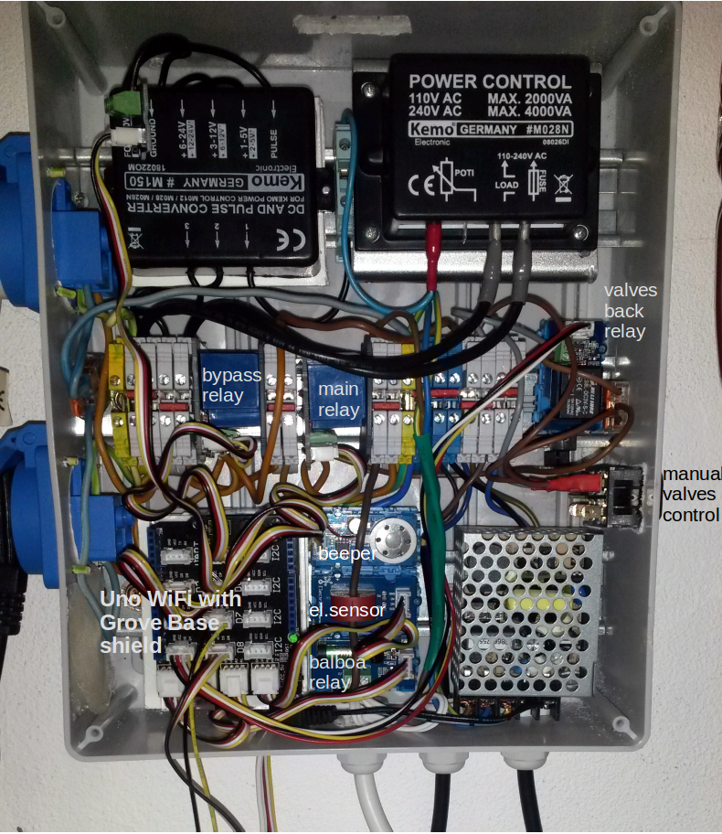
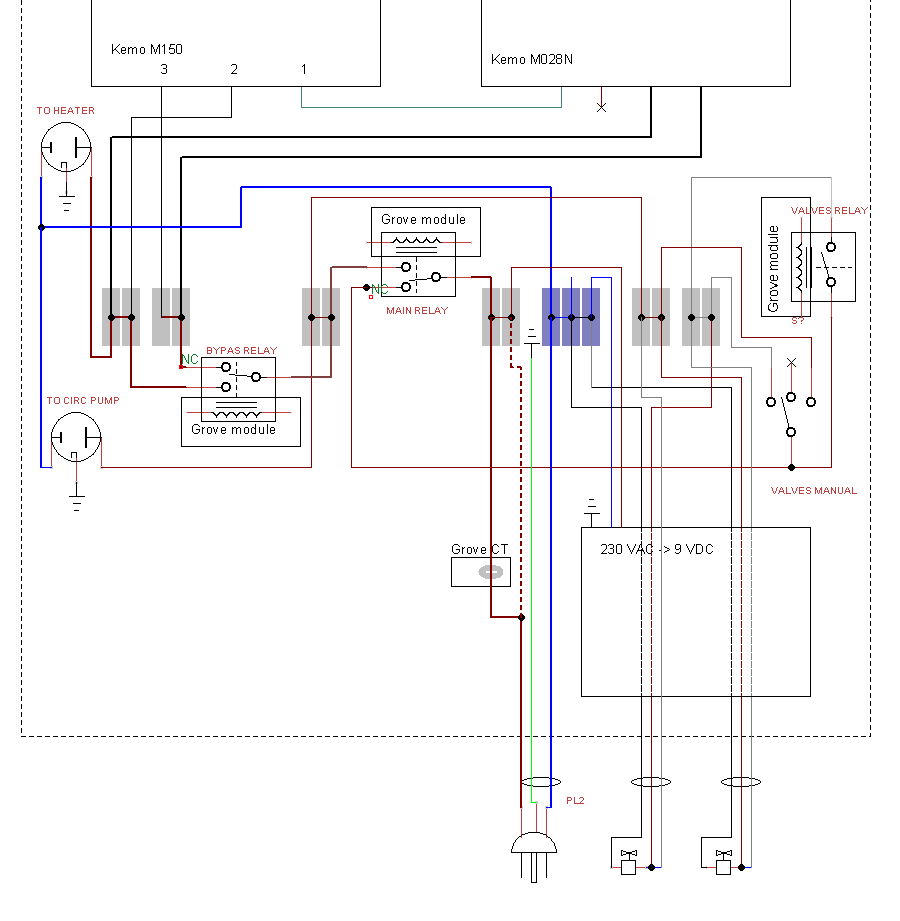

# Regulator

DIY Arduino [consumption regulator](https://github.com/jandrassy/Regulator/wiki) build to use excess solar power for auxiliary 'summer' heating. The solar power data are retrieved over SunSpec Modbus TCP. IoT monitoring with Blynk.

## Intro

I have in the basement a small wellness room with a hot tub. The room has a floor heating and in the winter there is pleasantly warm. But in summer the floor was uncomfortable cold. After I bought a Fronius Symo Hybrid PV system, I discovered that I could use the excess solar power in summer to heat with a small 2kW electric heater the water of the floor heating of that room.

For the PWM regulation I discovered Arduino. I am a professional software developer so the programming was the easy and fun part. And building the box was fun too. After a year it is still work in progress with additional functions and control.

To regulate the water heater using excess solar power Fronius has Ohmpilot. It is still not available for hybrid PV systems and it can't do the additional control that my regulator does, like commanding valves or turning off some other deferrable consumption.

I don't think someone could take this project and use it without changes, but the concept and many parts of the project can help to build a similar system. The source code is modular with multiple ino files. They are all like add-ons to the main Regulator.ino which handles only the core parts of the system. Most of the additional ino files can be simply removed, because they are special for my system or add only additional optional control and/or monitoring.

I decided to go the multiple ino code separation way with almost no encapsulation of partial functionality. I could encapsulate functionality into classes with declarations in h files, but it would be only more work for me and harder to understand and reuse for a hobby coder.

## Pictures

### Heating

### Box

### AC schema

## Hardware

### Electronics
* [Arduino Uno WiFi](https://github.com/jandrassy/UnoWiFiDevEdSerial1/wiki) - can be replaced by any AVR 5V Arduino with some shield or module for networking
* [Seeed Grove Base Shield](https://www.seeedstudio.com/Base-Shield-V2-p-1378.html) - the Grove connectors ensure firm connection of wires with simple assemble and disassemble
* [Grove 30 A Relay module](https://www.seeedstudio.com/Grove-SPDT-Relay%2830A%29-p-1473.html) 2pcs - the AC current in the system is less then 10 A but it can run hours at 9+ A 
* [Grove Electricity Sensor module](https://www.seeedstudio.com/Grove-Electricity-Sensor-p-777.html) - a module with current transformer to measure the AC current up to 10 A
* [Grove Relay](https://www.seeedstudio.com/Grove-Relay-p-769.html) - for 'valves back' circuit
* [Grove Temperature Sensor](https://www.seeedstudio.com/Grove-Temperature-Sensor-p-774.html) - to check the next heating distributor if the main heating is running
* [Grove Dry-Reed Relay](https://www.seeedstudio.com/Grove-Dry-Reed-Relay-p-1412.html) is for Balboa hot tub heating suspend activation
* Beeper - the Speaker module with amplifier you can see on the box photo, was a wrong choice. The amplifier was catching WiFi interference 
* [Grove LED Bar](https://www.seeedstudio.com/Grove-LED-Bar-v2.0-p-2474.html) - 10 LEDs with individual dimming needing only any two digital pins 
* Button - plain momentary push-button to be used with Atmega internal pin pull-up (do not use the Grove button module, it has a pull-down and when you disconnected it, the pin floats)
* Kemo M028N with [Kemo M150](https://www.kemo-electronic.de/en/Transformer-Dimmer/Converter/M150-DC-pulse-converter.php) - to regulate the heating power with PWM signal. The high VA rating is necessary because the system can run hours on maximum.
* [Grove Screw Terminal](https://www.seeedstudio.com/Grove-Screw-Terminal-p-996.html) - to connect Grove connector to M150
* [Grove Wrapper](https://www.seeedstudio.com/Grove-Blue-Wrapper-1%2A2%284-PCS-pack%29-p-2583.html) - to fasten the Grove modules to a DIN rail mount (the Grove 30 A relays don't fit into Grove wrappers)

### Heating system
* [TEZA2000 heating](https://www.teza-eshop.sk/products/produkt-1/) - this small electric heating is a local 'invention'
* circulation pump - set at 40 W 
* Servo valves [Lufberg ZV-2](http://www.lufberg.eu/index.php/zv2-98.html) - simple and cheap, it disconnects AC on end-stop

## Sketch

Copy the folder `Regulator`from this GitHub repository into your sketch folder of Arduino IDE.

### System
* Regulator.ino - core: global variables, setup() and loop() handling network, heating relays, main states
* Events.ino - data saved to EEPROM for monitoring
* Modbus.ino - reads the PV SunSpec data and time
* Watchdog.ino - AVR watchdog

### Heating
* PowerPilot.ino - heater regulation with PWM to exactly consume the excess solar electricity calculated from SunSpec data. [more...](https://github.com/jandrassy/Regulator/wiki/PowerPilot)
* ManualRun.ino - unregulated timed heating, activated with a button or from a remote monitoring
* ElSens.ino - functions around the electricity sensor: checking expected consumption of the pump and heating and detecting disconnection by the heater's thermostat
* ValvesBack.ino - handles turning valves back to the main heating system, if temperature sensor detects warming of the second heating circuit

### Front panel
* Beeper.ino - Handles the speaker using tone() function. In loop handles the alarm sound if the system is in alarm state.
* Button.ino - handles push and long push ('manual run') of the physical button on the front panel
* LedBar.ino - handles visualization on the front panel LED Bar: blink, alarm, power level, count-down etc.

### Monitoring
* Telnet.ino - logging csv lines to telnet client and reading command characters sent from telnet client
* RestServer.ino - JSON data for the web pages 
* Blynk.ino - control from everywhere with [Blynk](https://www.blynk.cc/) Android application. [more...](https://github.com/jandrassy/Regulator/wiki/Blynk)

### Symo Hybrid Battery
* BattSett.ino - SunSpec Modbus storage control
* SusCalib.ino - at 9 am sends 'calibration disable' for 3 hours

### Special
* Balboa.ino - defers hot tub heating if overall household consumption exceeds PV inverter's limit

### Web interface

The RegulatorPages folder contains static web pages of the regulator. The static web pages use data in json format requested from the RestServer implemented in RestServer.ino.

I have the static pages served by the esp8266 WebServer of WiFi Link firmware in the esp8266 on-board of the Uno WiFi. I added them to the SPIFFS `data` folder of WiFi Link firmware.

## Plans

The complete project doesn't fit into the Uno flash memory. It is 1000 bytes larger. To run it, I commented out the RestServer setup and loop and the builder leaves the RestServer.ino functions and Evenst.ino json functions out. Nevertheless I want try to make a version of the Regulator with Ethernet shield for networking and SD card fro logging. I want to add WebServer.ino to serve web pages from SD card and SDLogging.ino to create csv log files and download them over WebServer. It should fit into a Mega.

And then, I create a branch of this project to rewrite it for esp8266 using the pins of connected Uno with Firmata or some simple sketch. 

