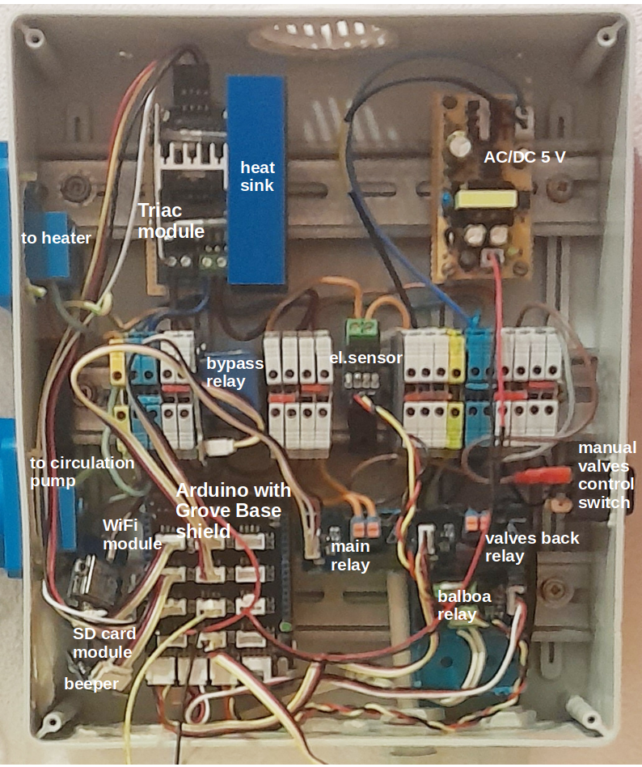

# Regulator

DIY Arduino [consumption regulator](https://github.com/jandrassy/Regulator/wiki) build to use excess solar power for auxiliary 'summer' heating. The solar power data are retrieved over SunSpec Modbus TCP. IoT monitoring with Blynk.

## Intro

I have in the basement a small wellness room with a hot tub. The room has a floor heating and in the Winter there is pleasantly warm. But in Summer the floor was uncomfortable cold. After I bought a Fronius Symo Hybrid PV system, I discovered that I could use the excess solar power in Summer to heat with a small 2kW electric heater the water of the floor heating of that room.

For the PWM regulation of "PWM to 'phase cutting' adapter box" I discovered Arduino. I am a professional software developer so the programming is the easy and fun part. And building the box was fun too. And it is still work in progress with improvements, additional functions and control. In Jun 2019 I replaced the PWM-to-phase-cutting module with Triac Dimmer module with the Triac directly controlled by the Arduino.

To regulate the water heater using excess solar power Fronius has Ohmpilot, but it can't do the additional control which my regulator does, like commanding valves or turning off some other deferrable consumption.

I don't think someone could take this project and use it without changes, but the concept and many parts of the project can help to build a similar system. The source code is modular with multiple ino files. They are all like add-ons to the main Regulator.ino which handles only the core parts of the system. Most of the additional ino files can be simply removed, because they are special for my system or add only additional optional control and/or monitoring.

I decided to go the multiple ino code separation way with almost no encapsulation of partial functionality. I could encapsulate functionality into classes with declarations in h files, but it would be only more work for me and harder to understand and reuse for a hobby coder.

## Pictures

### Heating

### Regulator box

### AC schematics

### Regulator box versions with Kemo modules

* [with Arduino Uno WiFi](img/regulator-labeled.png)
* [with Wemos D1 R2](img/regulator-d1-labeled.png)
* [with M0 and ENC28J60 Ethernet module](img/regulator-m0-labeled.png)
* [AC schematics](img/schemaAC.png)
* [AC schematics without valves control](img/schemaACsimple.png)

## Hardware

### Electronics
* Arduino with some shield or module for networking and optional SD card reader for static web files and csv logging
* [Seeed Grove Base Shield](https://www.seeedstudio.com/Base-Shield-V2-p-1378.html) - the Grove connectors ensure firm connection of wires with simple assemble and disassemble and the shield supplies 5 V VCC for the Grove modules.
* [Robotdyn AC Light Dimmer Module](https://robotdyn.com/catalog/new-products/ac-light-dimmer-module-2-channel-3-3v-5v-logic-ac-50-60hz-220v-110v.html) - Triac and zero crossing detector for direct AC phase cutting. I use the double dimmer for larger cooler. For 2 kW the single dimmer overheated. First I added a fan. It helped but it was noisy. For 1.5 kW or less it should be good.
* [Grove 30 A Relay module](https://www.seeedstudio.com/Grove-SPDT-Relay%2830A%29-p-1473.html) 2pcs
* ACS712 current sensor module
* [Grove I2C ADC module](https://www.seeedstudio.com/grove-i2c-adc-p-1580.html) - to read the electricity sensor with esp8266
* [Grove Relay](https://www.seeedstudio.com/Grove-Relay-p-769.html) or [Grove Solid State Relay V2](https://www.seeedstudio.com/Grove-Solid-State-Relay-V2-p-3128.html) - for 'valves back' circuit
* [Grove Temperature Sensor](https://www.seeedstudio.com/Grove-Temperature-Sensor-p-774.html) - to check the next heating distributor if the main heating is running
* [Grove Dry-Reed Relay](https://www.seeedstudio.com/Grove-Dry-Reed-Relay-p-1412.html) is for Balboa hot tub heating suspend activation
* [Grove Speaker](https://www.seeedstudio.com/Grove-Speaker-p-1445.html) - Speaker module with amplifier for strong beeps
* [Grove LED Bar](https://www.seeedstudio.com/Grove-LED-Bar-v2.0-p-2474.html) - 10 LEDs with individual dimming requiring only any two digital pins 
* 5 mm status LED with resistor as simple alternative to LED Bar
* Button - plain momentary push-button to be used with internal pin pull-up (do not use the Grove button module, it has a pull-down and when you disconnected it, the pin floats. or with esp8266 it can be used on io 16 with internal pull-down set)
* [Grove Wrapper](https://www.seeedstudio.com/Grove-Blue-Wrapper-1%2A2%284-PCS-pack%29-p-2583.html) - to fasten the Grove modules to a DIN rail mount (the Grove 30 A relays don't fit into Grove wrappers)

#### Removed components

* Kemo M028N with [Kemo M150](https://www.kemo-electronic.de/en/Transformer-Dimmer/Converter/M150-DC-pulse-converter.php) - to regulate the heating power with PWM signal. The high VA rating is necessary because the system can run hours on maximum.
* [Grove Screw Terminal](https://www.seeedstudio.com/Grove-Screw-Terminal-p-996.html) - to connect Grove connector to M150
* [Grove Mosfet](https://www.seeedstudio.com/Grove-MOSFET-p-1594.html) - instead of Screw Terminal for 5 V PWM with 3.3 V boards  

### MCU options
* [Arduino Uno WiFi](https://github.com/jandrassy/UnoWiFiDevEdSerial1/wiki) 
* any AVR Arduino in Uno or Mega format with some shield or module for networking
* Arduino Zero or M0 in Uno format with some shield or module for networking and with SD card to save events (no EEPROM)
* esp8266 board in Uno format like the Wemos D1 R2, which can be used with Grove Base Shield
* Arduino MKR board on Arduino MKR Connector Carrier (Grove compatible) with on-board WiFi, ETH Shield or other networking module  
* Nano 33 IoT with [Nano Grove shield](https://www.seeedstudio.com/Grove-Shield-for-Arduino-Nano-p-4112.html)

### Heating system
* [TEZA2000 heating](https://www.teza-eshop.sk/products/produkt-1/) - this small electric heating is a local 'invention'
* circulation pump - set at 40 W 
* Servo valves [Lufberg ZV-2](http://www.lufberg.eu/index.php/zv2-98.html) - simple and cheap, it disconnects AC on end-stop

## Sketch

Copy the folder `Regulator`from this GitHub repository into your sketch folder of Arduino IDE and the TriacLib folder goes into your libraries folder.

### System
* Regulator.ino - core: global variables, setup() and loop() handling network, heating relays, main states
* Events.ino - data saved to EEPROM or SD for monitoring
* Modbus.ino - reads the PV SunSpec data and time
* Watchdog.ino - watchdog handling

### Heating
* PowerPilot.ino - heater regulation with AC phase cutting to exactly consume the excess solar electricity calculated from SunSpec data. 
* ManualRun.ino - unregulated timed heating, activated with a button or from a remote monitoring
* ElSens.ino - functions around the electricity sensor: checking expected consumption of the pump and heating and detecting disconnection by the heater's thermostat
* ValvesBack.ino - handles turning valves back to the main heating system, if temperature sensor detects warming of the second heating circuit
* TriacLib.h - AC dimmer module control

### Front panel
* Beeper.ino - Handles the speaker using tone() function. In loop handles the alarm sound if the system is in alarm state.
* Button.ino - handles push and long push ('manual run') of the physical button on the front panel
* LedBar.ino - handles visualization on the front panel LED Bar: blink, alarm, power level, count-down etc.
* StatusLed.ino - shows state with plain LED as simple alternative to LED Bar 

### Monitoring
* Telnet.ino - logging csv lines to telnet client and reading command characters sent from telnet client
* CsvLog.ino - logging heating regulation to csv files on SD card or SPIFFS
* Stats.ino - count and store power consumption statistics
* WebServer.ino - JSON data for the web pages with optional serving of static web page files and csv files from SD card or SPIFFS
* Blynk.ino - control from everywhere with [Blynk](https://www.blynk.cc/) Android application. [more...](https://github.com/jandrassy/Regulator/wiki/Blynk)

### Symo Hybrid Battery
* BattSett.ino - SunSpec Modbus storage control
* SusCalib.ino - at 9 am sends 'calibration disable' for 3 hours

### Special
* ConsumptionMeter.ino - take data from secondary Fronius Smart Meter measuring this heater's consumption. Value is only logged to csv for evaluation (charts in Calc). It is an alternative to WemoInsight.ino.
* WemoInsight.ino - web service request to Belkin WiFi switch used as system's reference Watt-meter. Value is only logged to csv for evaluation (charts in Calc). It is an alternative to ConsumptionMeter.ino.
* Balboa.ino - defers hot tub heating if overall household consumption exceeds PV inverter's limit

### Web interface

The data subfolder contains static web pages of the regulator. The static web pages use data in json format requested from the WebServer implemented in WebServer.ino.

With Uno WiFi I had the static pages served by the esp8266 WebServer of WiFi Link firmware in the esp8266 on-board of the Uno WiFi. I added them to the SPIFFS `data` folder of WiFi Link firmware.

WebServer.ino can serve the pages from SD card or SPIFFS.

These static web pages can be started from a folder on a computer to show the data from Regulator. Only set the IP address of Arduino in script.js.

## Comments

The complete project doesn't fit into the Uno flash memory. To run it, comment out less important functions in setup and loop and the builder leaves the code out. 

## Project log

2017/4 First board used in this project was Uno WiFi.

2018/5 Next board was Wemos D1 R2 esp8266. 

2018/8 I wanted Ethernet and 32 bit MCU. I moved to Crowduino MO -SD with Ethernet Shield

2019/1 ENC28J60 Ethernet module 

2019/5 secondary Fronius Smart Meter measures the heater for Fronius Solarweb

2019/6 I replaced the Kemo modules with the AC 'dimmer' module

2019/9 AVR ATmega1284p board and Ethernet Shield with W5500 (Seeed version with low profile RJ-45 connector) 

2019/10 Grove Electricity Sensor CT replaced with ACS712 and Grove I2C ADC removed
 
2020/05 I bought Blynk points and updated the Blynk dashboard and I added charts 