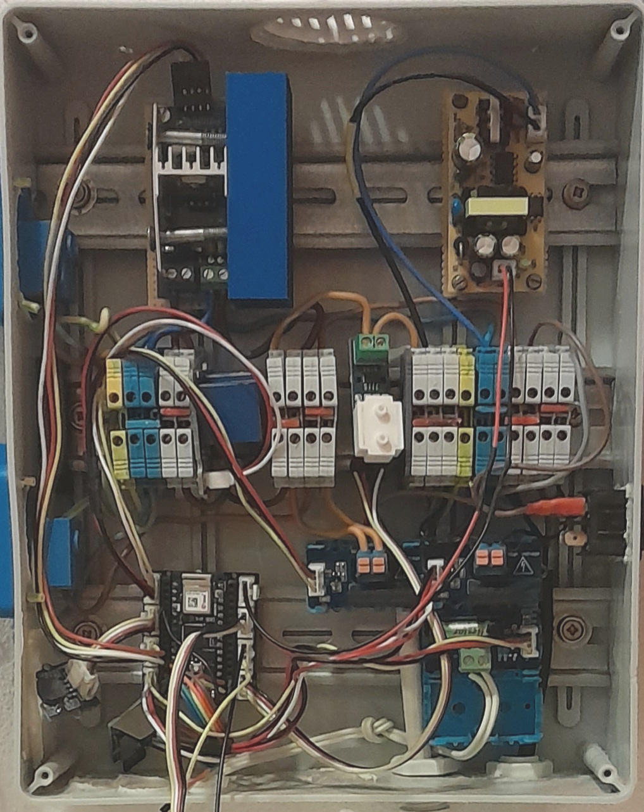

# Project history in images

## 2017

Kemo modules and Arduino Uno WiFi Developer Edition

## 2018-05

With Wemos D1 R2, MOSFET and I2C ADC module.

## 2018-09

Crowduino M0-SD with Ethernet shield and experiments with the ENC28J60 module.

## 2019

Kemo modules replaced with Triac/ZC module.

# 2020 - 2021

AVR ATmega1284p board with Ethernet Shield, CT replaced with ACS712 and the power adapter replaced.

ENC28J60 with my EthernetENC library. Circ. pump relay experiment.

# 2022

Single Triac module with a large heatsink.

End of circ. pump experiment. SSR relays.

Nano 33 IoT experiment with a temporary voltage divider on a mini breadboard.

MKR Connector Carrier experiment with a MKR1000 WiFi.

